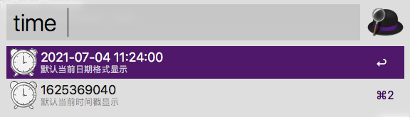
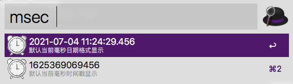

# Alfred-Workflows-TimeStamp
**初衷**：该 Alfred  Workflows Timestamp 是针对时间戳+日期之间的相互格式转换，平常我们可能更多的是在
站长工具或者其他网页进行转换，每次打开网页很麻烦，网络差的时候更难受了！

目前为止我没有看到一个自己比较满意的插件，刚好公司好多童鞋也需要，就自己开发一个插件！如果有问题或者需要改进的问题
可以在issues中联系我反馈 或者 通过 尾部联系方式联系我！下载地址：[TimeDateChange.alfredworkflow](TimeDateChange.alfredworkflow)
下载会后双击导入就可以了！

## 插件说明

- 本插件是PHP语言实现(需要python版本可联系作者)
- 支持时间戳(秒+毫秒) + 日期格式相互转换

## 使用说明

 - time  支持时间戳(秒) + 日期之间的转换 默认返回当前时间戳 + 日期
 - msec  支持时间戳(毫秒) + 日期之间的格式转换  默认返回 毫秒时间戳 + 日期
 - 时区默认中国时区，可以根据php文件修改时区
 
 ## 最终效果图
 
 
 
  
  
  ## 作者信息
  
   * 作者： 我是阿沐(Jonny Lee)
   * Email： lw1772363381@163.com